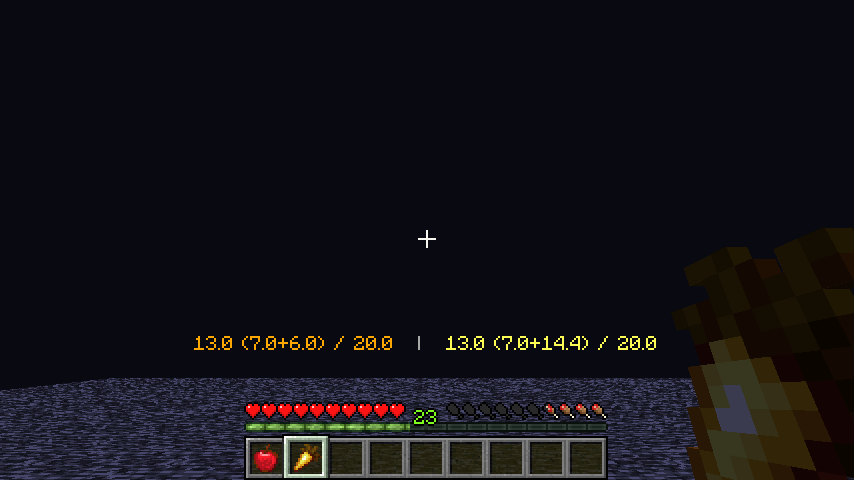

# 苹果肉 (AppleFlesh)

苹果肉是一个 Minecraft 数据包，适用于 Java 版 1.15-1.19.4。

| 文件 | 支持的 Minecraft 版本 |
| - | - |
| **1.0.1 for 1.15** | 1.15-1.16.5 |
| **1.0.1 for 1.17** | 1.17-1.19.4 |

当玩家手持食物时：在状态栏显示玩家当前的饥饿值、饱和度，手持食物所能提供的饥饿值、饱和度，食用手持食物后饥饿值、饱和度会变成的值。

## 说明

如图，左边的 **13.0 (7.0+6.0) / 20.0** 是指：

- 玩家当前的饥饿值为 7.0；
- 手持食物所能提供的饥饿值为 6.0；
- 食用手持食物后饥饿值会变为 13.0；
- 饥饿值上限为 20.0。

右边的 **13.0 (7.0+14.4) / 20.0** 是指：

- 玩家当前的饱和度为 7.0（保留一位小数）；
- 手持食物所能提供的饱和度为 14.4；
- 食用手持食物后饱和度会变为 13.0（饱和度不能超过饥饿值）；
- 饱和度上限为 20.0。

## 注意

- 不考虑食物附带的状态效果对玩家饥饿值、饱和度的影响，如河豚、腐肉、生鸡肉、带有饱和效果的迷之炖菜；
- 蛋糕以一整个计算，即能提供 14 饥饿值、2.8 饱和度；
- 仅支持原版中的食物。
