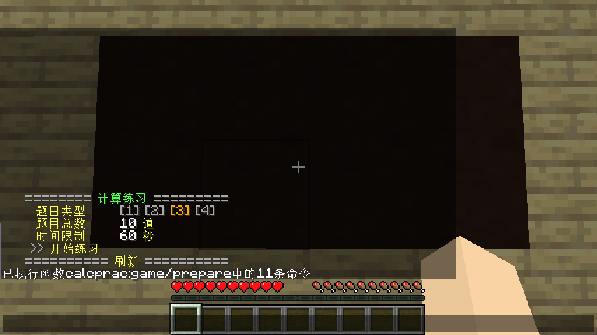
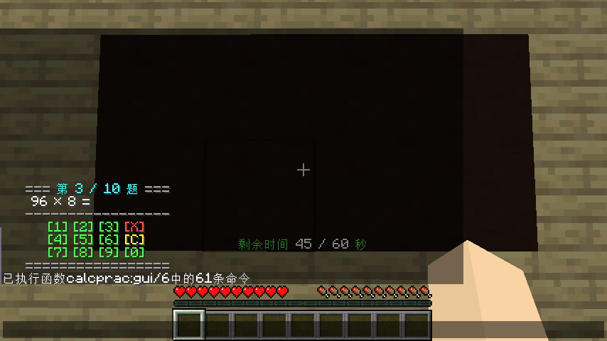
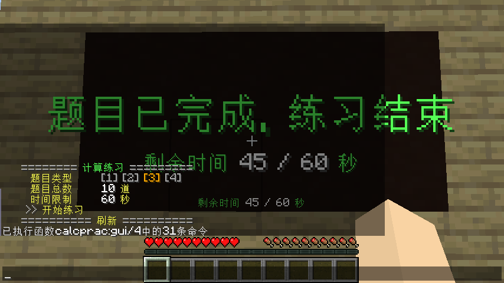
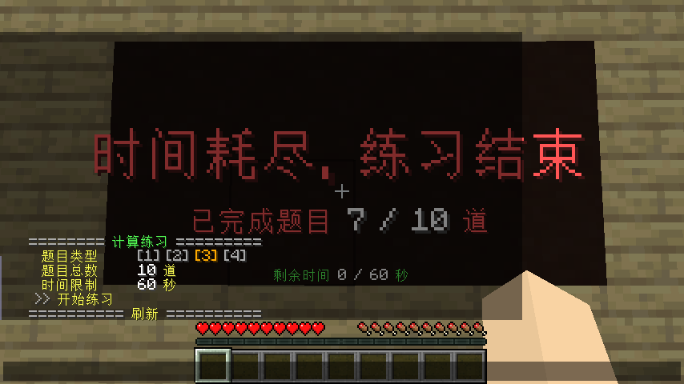

# 计算练习 (CalcPrac)

Minecraft 数据包，支持 Java 版 1.14.4、1.15.2 和 1.16.5，其他版本未测试。

## 如何开始

下载后放入 `datapacks` 文件夹，进入游戏。

使用命令 `/function calcprac:game/prepare` 打开准备页面。

## 准备页面

### 题目类型

| 题目类型 | 说明 |
| - | - |
| 1 | 三位数加三位数 |
| 2 | 三位数减三位数 |
| 3 | 两位数乘一位数（一位数不包括 1） |
| 4 | 三位数除以一位数（结果精确到个位） |

点击图中的 `[1]`、`[2]`、`[3]`、`[4]` 即可切换到相应题型。

### 题目总数

点击图中的 `10` 并输入另一数字后按下回车，即可修改。

点击`刷新`，查看修改后的结果。

### 时间限制

单位：秒。完成所有题目消耗的时间应在时间限制之内，否则失败。

点击图中的 `60` 并输入另一数字后按下回车，即可修改。

点击`刷新`，查看修改后的结果。

### 开始练习

点击图中的`开始练习`，即可开始。

## 答题页面

点击图中的 `[0]` ~ `[9]` 输入相应数字，点击 `[X]` 退位，点击 `[C]` 重新输入。

输入正确答案后会自动进入下一题。

## 胜利页面

## 失败页面

## 卸载

使用命令 `/function calcprac:remove` 移除本数据包添加的记分板、标签。

请手动删除本数据包。