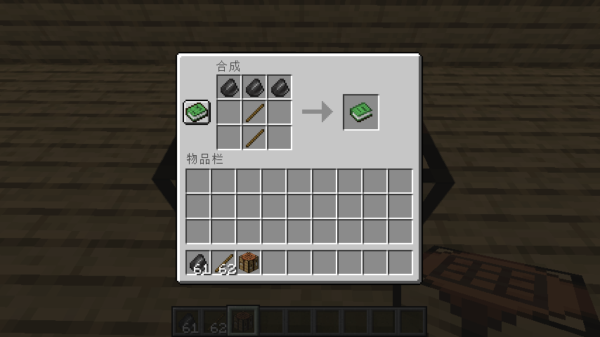

# [1.16.5] 用 `recipe_unlocked` 实现合成带 NBT 的物品

地址：[GitHub](https://github.com/Muggle2077/Minecraft/blob/tutorials/NBT_Crafting/README.md)，[Gitee](https://gitee.com/muggle2077/minecraft/blob/tutorials/NBT_Crafting/README.md)

## 原理

原版配方不支持合成带 NBT 的物品。

玩家在合成物品时会解锁相应配方。我们可以利用进度的 `minecraft:recipe_unlocked` 触发器来检测某配方是否被解锁，以判断玩家是否合成了该物品。

若合成了，则将产物替换为带 NBT 的物品。

## 实现

例如，我们想用 3 颗燧石和 2 根木棒合成一把锋利 I 的石镐。

1. 写一个配方 `muggle:stone_pickaxe`，用 3 颗燧石和 2 根木棒合成一本配方书。



```
{
  "type": "minecraft:crafting_shaped",
  "key": {
    "#": {
      "item": "minecraft:flint"
    },
    "/": {
      "item": "minecraft:stick"
    }
  },
  "pattern": [
    "###",
    " / ",
    " / "
  ],
  "result": {
      "item": "minecraft:knowledge_book",
      "count": 1
  }
}
```

2. 写一个进度 `muggle:stone_pickaxe`，检测上述配方被解锁。

```
{
  "rewards": {
    "function": "muggle:stone_pickaxe"
  },
  "criteria": {
    "tick": {
      "trigger": "minecraft:recipe_unlocked",
      "conditions": {
        "recipe": "muggle:stone_pickaxe"
      }
    }
  }
}
```

3. 写一个函数 `muggle:stone_pickaxe`，在配方被解锁后，将配方书替换为锋利 I 的石镐。

```
# 统计配方书的数量
execute store result score #count muggle run clear @s minecraft:knowledge_book
# 按数量将配方书替换为石镐
execute if score #count muggle matches 1.. run function muggle:knowledge_book
# 移除石镐配方
recipe take @s muggle:stone_pickaxe
# 移除进度
advancement revoke @s only muggle:stone_pickaxe
```

4. 函数 `muggle:knowledge_book`

```
# 配方书数量 -1
scoreboard players remove #count muggle 1
# 石镐数量 +1
give @s minecraft:stone_pickaxe{Enchantments:[{id:"minecraft:sharpness",lvl:1s}]} 1
# 如果还有配方书，重复上述命令
execute if score #count muggle matches 1.. run function muggle:knowledge_book
```

5. 在第 3 步中使用了记分板 `muggle`，因此要在带有 `minecraft:load` 标签的函数中先建立该记分板。

函数标签 `minecraft:load`

```
{
  "replace": false,
  "values": [
    "muggle:load"
  ]
}
```

函数 `muggle:load`

```
# 记分板用于存储配方书的数量
scoreboard objectives add muggle dummy
```

## 数据包

[点此查看](datapack.zip)

## 声明

此方法非本人原创，原作者已不可考。

## 感谢

[SPGoding](https://github.com/SPGoding) 的 [Data-pack Helper Plus](https://marketplace.visualstudio.com/items?itemName=SPGoding.datapack-language-server) 为本文的编写提供了支持。
